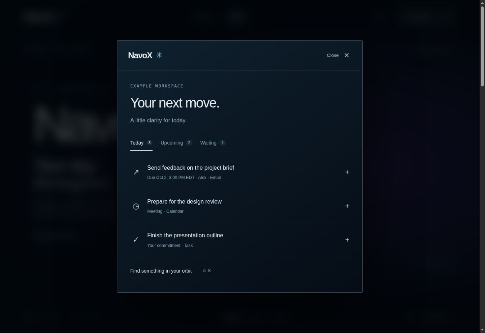
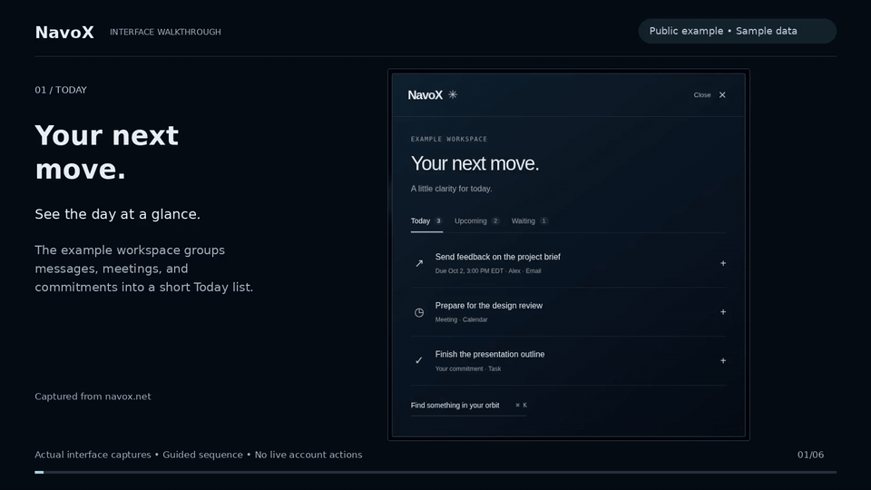
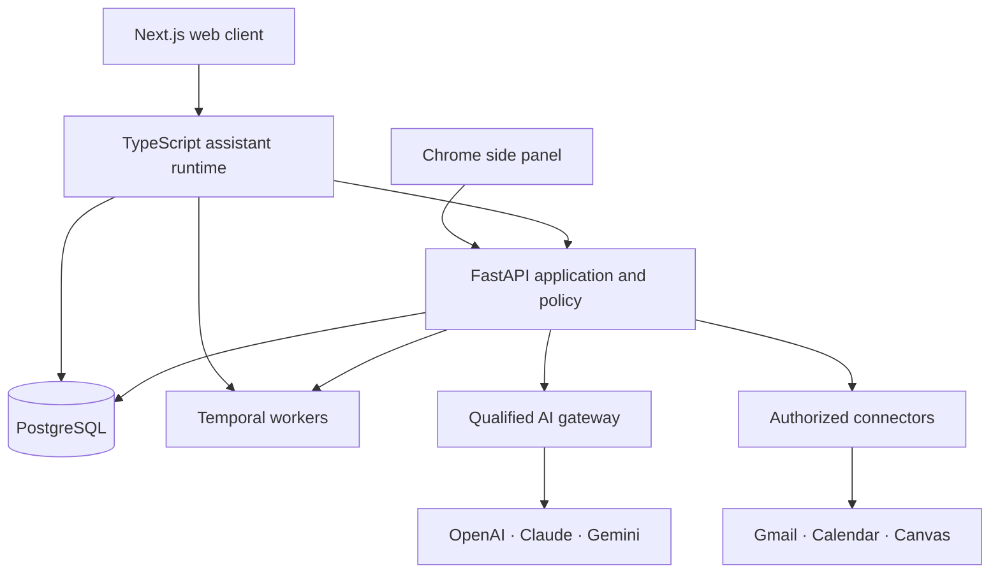

# NavoX

**A personal AI assistant for the work scattered across your inbox, calendar, classes, and subscriptions.**

[Open NavoX](https://navox.net) · [Architecture](#architecture) · [Run locally](#run-locally) · [Verification](#verification)

NavoX brings connected information into a daily view and a persistent conversation.
Ask what needs your attention, find a source, prepare for a meeting, or draft a reply.
When a request changes something outside NavoX, the application separates preparation,
approval, execution, and verification.

## See it in action



[](docs/media/navox-walkthrough.mp4)

**[Watch the walkthrough](docs/media/navox-walkthrough.mp4)**

The guided video uses real captures of the public interactive example workspace:
Today, Upcoming, Waiting, source details, and task search. Its data is authored for
the example. It does not demonstrate authenticated account retrieval or sending.

## What it does

| Area | Implemented behavior |
| --- | --- |
| Daily priorities | Evidence-backed commitments, upcoming meetings, follow-ups, and user-controlled attention preferences. |
| Connected accounts | Explicitly authorized Gmail, Google Calendar, and institution-configured Canvas connections. |
| Conversations and search | Saved sessions, bounded multi-intent planning, source-linked retrieval, and clarification when evidence is ambiguous. |
| Voice | Recorded microphone input, gateway-routed speech-to-text and text-to-speech, read-aloud controls, and text/voice delivery preferences. |
| Subscriptions | Recurring costs, renewals, trials, and price changes; amounts remain separate by currency. |
| News | Source-backed stories, questions, and follow-up research, with source rights and freshness checks. |
| Chrome side panel | The same API, priorities, plan status, and exact-action review, plus explicitly initiated page-note capture. |

The repository contains these implementations; connector access and live AI availability
depend on the deployed workspace, OAuth configuration, and approved provider routes.
Hands-free recognition is browser-dependent. A test suite passing does not establish
live voice quality or complete end-to-end acceptance of every integration.

## Engineering decisions

- **One provider boundary.** Python HTTP adapters support OpenAI, Anthropic Claude,
  and Google Gemini behind a versioned gateway. Exact model/task/prompt/schema
  qualification, sensitivity grants, token/cost limits, and circuit breakers govern
  serving. Adapter support does not automatically enable a model or a fallback.
- **Approval binds the action.** Email review displays the exact recipient, subject,
  and body. Material edits invalidate prior approval. The worker rechecks ownership,
  permissions, version, and payload hash before execution. Ambiguous send failures
  enter manual review instead of being blindly retried.
- **Durability without hidden authority.** Temporal coordinates source processing,
  attention timers, and bounded workflows. The assistant goal worker receives an
  opaque goal ID and rechecks saved state; it cannot approve or execute an action.
- **Scoped state and evidence.** PostgreSQL stores owned sessions, source references,
  plans, approval versions, and audit events. Retrieval and action boundaries
  revalidate workspace/account access rather than trusting a client-supplied ID.

## Architecture



The TypeScript runtime owns conversation orchestration and its session schema.
The Python API owns connector permissions, provider routing, operational state,
and consequential action policy. They share contracts without duplicating authority.

| Path | Responsibility |
| --- | --- |
| `apps/web` | Next.js interface and authenticated assistant routes |
| `apps/extension` | Manifest V3 side panel and explicit capture |
| `packages/assistant-runtime` | Session orchestration, voice contracts, and bounded goal workflows |
| `packages/contracts` | Shared TypeScript API contracts |
| `services/api/navox` | FastAPI services, connectors, retrieval, gateway, and policy |
| `services/api/migrations` | Python-owned PostgreSQL migrations |
| `evals` | Synthetic evaluation cases and reference baselines |
| `docs/architecture` | Design decisions, operational procedures, and acceptance boundaries |

## Run locally

The container path requires Git and Docker Engine/Desktop with Compose v2.
Images pin Python 3.12, Node 24, PostgreSQL 17, and Temporal.

```bash
git clone https://github.com/michaelbawuah/NavoX.git
cd NavoX
cp .env.example .env
docker compose up --build
```

Open [the web app](http://localhost:3000), [API documentation](http://localhost:8000/docs),
or [Temporal UI](http://localhost:8080). Register a local account to explore the shell.
The stack applies the Python and TypeScript migrations before the web service starts.
First startup can take several minutes while dependencies and images build.

The example environment starts with AI providers disabled and blank OAuth credentials.
It does not connect to an inbox or start paid model requests. Configure your own
credentials outside version control, then follow the [gateway setup](docs/architecture/spec-005-gateway.md)
and [connector operations](docs/architecture/spec-002-operations.md) procedures.
Google sign-in alone does not grant Gmail read/send access.

For host development, use Node 24, npm 11, Python 3.12, and `uv`.
The [reference guide](docs/reference-guide.md#first-time-setup) contains terminal-by-terminal
setup, and the [deployment guide](deploy/README.md) covers the production overlay.

### Chrome extension

```bash
npm ci
npm run build --workspace=@navox/extension
```

In `chrome://extensions`, enable Developer mode, select **Load unpacked**, and choose
`apps/extension/dist`. The local build uses the local API and web app. Deployment
origins and the permission boundary are documented in the
[extension guide](docs/architecture/milestone-8-chrome-extension.md).

## Verification

The [reviewed hosted CI checkpoint](https://github.com/michaelbawuah/NavoX/actions/runs/37160769439),
`df9397d`, recorded **2,820 API tests**, **437 web tests with 14 skipped**, and
**8 extension tests**. These are regression results for that source checkpoint,
not a production accuracy or availability claim. The assistant runtime has a
separate suite with database/Temporal-dependent cases.

The [CI workflow](.github/workflows/ci.yml) checks lint, types, builds, migrations,
dependency security, deterministic release evaluation, and Compose integration.
Evaluation fixtures are synthetic; live provider qualification is separate.

```bash
npm ci
npm run lint
npm run typecheck
npm run test
npm run build
bash scripts/check-api.sh
```

The API gate uses the committed `uv.lock` and requires disposable PostgreSQL/Temporal
services for the complete infrastructure-dependent suite. Missing infrastructure or
skipped cases must be reported; they are not a substitute for a passing full gate.
See [AGENTS.md](AGENTS.md) for the exact publication requirements.

Further reading: [approval and verified execution](docs/architecture/milestone-6-approval-execution.md),
[retrieval and connected intelligence](docs/agent-work/spec-006-007/SEARCH-REPORT.md),
[gateway qualification](docs/architecture/spec-005-live-acceptance.md), and
[bounded goal workflows](docs/agent-work/spec-008/M14B-BOUNDED-WORKFLOWS-WORKER-REPORT.md).

## License

No open-source license has been granted. The source is available for inspection;
all rights are reserved by the owner.
